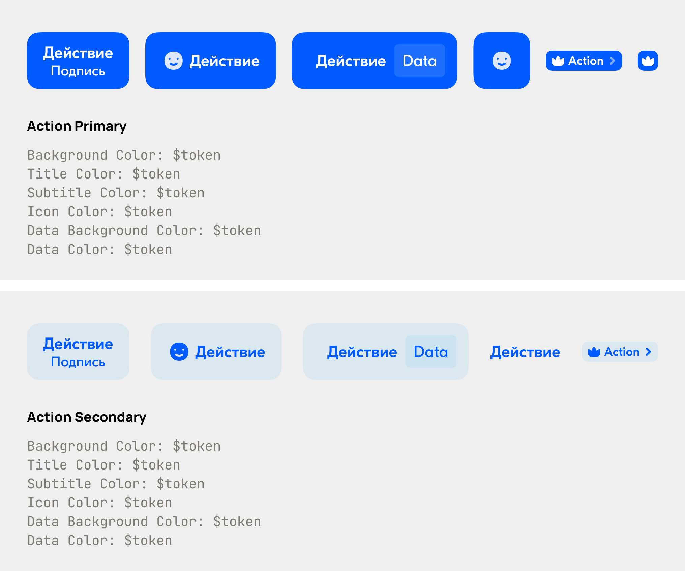
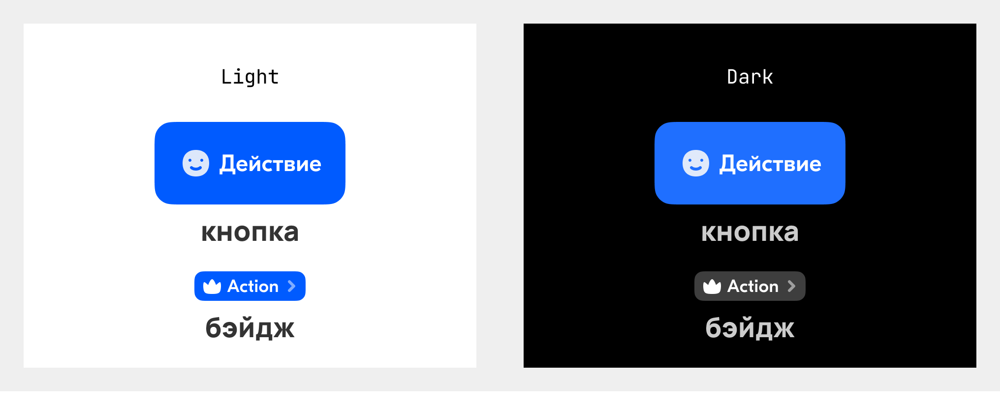

# Цвета

На всех платформах используем единую систему токенов цветов.

## Как дизайнеры видят работу с цветами

Есть несколько типов палитр:
- `core`
  - **что это:** нетемизирующиеся несемантические токены. Просто пара `<ключ>: <значение в RGB>`. 
    Эти токены будут использоваться дизайнерами в семантических токенах
  - **зачем это:** чтобы ограничить весь набор доступных оттенков и управлять ими централизовано.
    Да, это большой набор цветов.
    - Почему дизайнеры не видят необходимости в определении формул, 
      по которым отсчитываются оттенки: цвета работают по-разному, поэтому каждый цвет 
      подразумевает свою формулу. Эти формулы сложные и зависят от оттенка. При смене оттенка надо 
      менять и формулу (заново подбирать). Подбор формулы требует от дизайнера упороться. Нам 
      проще и целесообразнее задавать ратсяжки для каждого цвета, чем генерировать цвета программно 
  - **в продукте:** не используется. Разработчики, подключившие дизайн-систему к своему 
    пакету/солюшну не видят эти токены
  - **в библиотеках компонентов у разработки:** напрямую также не используются, в списке доступных цветов (когда 
    выбираем, чем покрасить тот или иной элемент компонента) не отображаются
  - **в дизайне:** в макетах фич и компонентов также не используются. Могут использоваться в 
    экспериментах, которые не идут в таком виде в разработку
- `base`
  - **что это:** публичный небольшой набор абстракций для цветов, то есть токенов со значениями и 
    для 
    тёмной, и для 
    светлой темы. Либо с одним значением для обеих тем
  - **в продукте:** доступны и используются
  - **в библиотеках компонентов у разработки:** доступны и используются
  - **в дизайне:** досутпны и используются, как в дизайне компонентов, так и в дизайне фич
- `component-<category>`
  - **что это:** приватные, доступные только внутри библиотек компонентов, абстракции для цветов
  - **зачем это:** чтобы использовать для покраски компонентов, но не давать использовать извне
  - **в продукте:** не используются, но из коробки работают в компонентах
  - **в библиотеках компонентов у разработки:** доступны и используются
  - **в дизайне:** используются только для покраски компонентов, в фичах не используются

### Зачем нужно разделять палитры на base и component

`component` нужны для того, чтобы стандартизировать использование цветов в интерфейсе 
(зафиксировать 
наши UX/UI-принципы средствами дизайн-системы). В дизайне мы хотим прийти к тому, чтобы для тех 
компонентов, для которых это возможно, использовались готовые _цветовые схемы_. Например, для 
кнопок будет что-то такое:



То есть, дизайнер, которому нужна кнопка в макете, не будет красить её в произвольные цвета. Он 
будет использовать один из доступных вариантов. На картинке выше это два допустимых варианта: 
`Action Primary` и `Action Secondary`.

При этом цветовые схемы для кнопок могут отличаться от цветовых схем для инпутов, алертов или 
бэйджей. Могут отличаться и необходимые токены: например, в инпутах нам надо красить бордеры, а 
в кнопках нет бордеров и токены для их покраски не нужны. Поэтому состав токенов в палитрах 
`component_<category>` может быть разным. Например:
- для кнопок:
  - bg — токены фонов кнопок в нормальном состоянии
  - bg-active — токены фонов кнопок в нажатом состоянии
  - bg-disabled — токены фонов кнопок в задизейбленном состоянии состоянии
  - text — токены для цветов текста
  - graphic — токены для цветов иконок
- для инпутов:
  - border — цвета обводок
  - border-active — цвета обводок в состоянии, когда инпут активен (все цвета — для обводок 
    инпута без ошибок и с ошибками)
  - bg
  - bg-active
  - и т.д.

Этих цветов может быть довольно много, в них легко запутаться, если сделать их публичными, 
поэтому мы хотим спрятать их от пользователей библиотек, сделать их доступными только внутри 
библиотеки.

Могут отличаться и принципы изменения цвета от темы к теме:



В примере выше фон кнопок остаётся цветным вне зависимости от темы. А с бэйджей в тёмной теме 
надо снять акцент, поэтому фон становится серым.

Но мы не можем заложить принципы для всего сразу. Точнее, есть очень абстрактные компоненты, 
вроде текстов и ячеек, покраска которых очень разнообразна, и правила, если мы и захотим 
заложить, то сделаем это сильно позже.

Поэтому, мы хотим оставить ограниченную палитру для использования в продуктах, эта палитра 
— `base`.

### Как определить, что можно красить в фичах?

Мы хотим разрешать это на уровне компонентов. Прямо в компонентах мы будем указывать, 
позволяют ли они кастомную покраску или же только выбор из доступных цветовых схем. 

## Как организованы файлы

Сейчас структура такая:
- `core` — один общий файл
  - `<группа>`
    - `<оттенок>`
- `base` — папка
  - `light` — жсон с цветами светлой темы
    - `<группа>`
      - `<роль>`
  - `dark` — жсон с цветами тёмной темы
    - `<группа>`
      - `<роль>`
  - `static` — жсон со статическими цветами
    - `<группа>`
      - `<роль>`
- `component_<example>` — папка
  - `light` — жсон с цветами светлой темы
    - `<группа>`
      - `<роль>`
  - `dark` — жсон с цветами тёмной темы
    - `<группа>`
      - `<роль>`
  - `static` — жсон со статическими цветами
    - `<группа>`
      - `<роль>`

Группа `component-<example>` приведена для примера. Таких файлов будет становиться много, но они
появятся позже, при проработке отдельных групп компонентов.

Таким образом примеры нейминга токенов в макетах:
- `core.banana.500` — но такие токены, как было сказано выше, не будут встречаться ни в макетах, 
  ни в компонентах
- `text.primary` — абстракция для изменяемого токена
- `static.text.secondary-on-light` — токен статичного цвета
- `component_button.text.secondary` — абстракция для компонента
- `component_button.static.text.secondary-on-light` — статичный цвет для компонента

## Примечания по парсингу 

Есть Figma-only жсоны `$themes` и `$metadata` — игнорируйте их при парсинге.

Значения токенов `core` — строго в формате RGB.

Структура объекта с токеном:
- `value` — собственно, настройки
- `type` — тип токена, для цвета всегда `color`
- `description` — может отсутствовать, поле с комментарием к стилю

Значения любых других токенов задаются в формате RGBA. Они либо ссылаются напрямую на core-токен, 
например:
```
"bg": {
  "primary": {
    "value": "{core.halva.500}",
    "type": "color"
  },
}
```

Либо задаются так:
```
"bg": {
  "secondary": {
    "value": "rgba({core.halva.500}, 0.1)",
    "type": "color"
  },
}
```