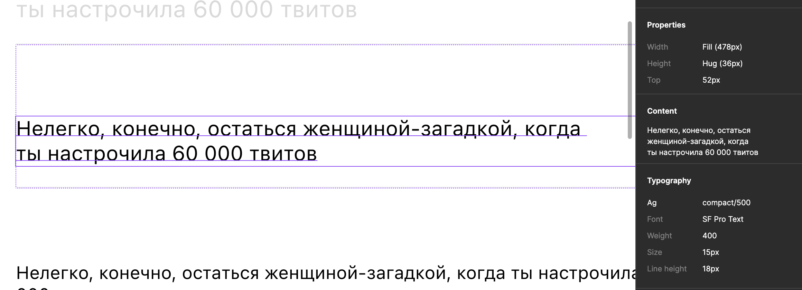

# Типографика

Токены типографики (текстовых стилей) для разных платформ имеют единый нейминг и структуру, но 
отличаются в значениях и некоторых настройках.

## Общее для всех платформ

Есть два типа жсонов:
- `core` — файл с общими переменными. Пока здесь лежит переменная для фирменного шрифта и 
  переменная `font-size` (нужно только для web). Сами шрифтовые файлы лежат в папке 
  `resources/fonts`
- `<platform-name>` — файлы со стилями для конкретных платформ

Есть Figma-only жсоны `$themes` и `$metadata` — игнорируйте их при парсинге.

Параметр `paragraphSpacing` можно игнорировать на всех платформах — мы будем задавать эти 
настройки на уровне компонентов для работы с текстом, а не на уровне стилей.

Стили представляют собой матрицу, в которой по первой оси идут категории:
- `big` – акцидентные стили для надписей, которые должны выделяться (в основном будут 
  использоваться для заголовков)
- `text` — стили для обычного текста (абзацы)
- `compact` – стили, аналогичные обычным текстовым, но с уменьшенной высотой строки (в основном 
  будут использоваться для коротких текстов)
- `numeric` — стили, аналогичные компактным текстовым, но с моноширинными цифрами (для таблиц и 
  ячеек, чтобы было удобно поразрядно сравнивать числа) 
- `reading` — особая группа стилей, которая пока будет использоваться для выделения врезок и 
  цитат в лонгридах

Дополнительные категории могут появляться в будущем.

Вторая ось матрицы — начертания в рамках одной и той же категории. Например, для всех категорий, 
кроме `reading` сейчас есть дублирующие категории `<category>-accent`. В accent-стилях 
дублируются все настройки не-accent, кроме начертания (`font-weight`) — в accent оно жирнее. То 
есть, такие стили будут использоваться, когда в абзаце используется тег `<b>`, например, или 
когда в компоненте нужно выделить текстовую строку.

Третья ось — размеры. Это сетка от 000 до 999, которая может состоять из разного количества 
размеров (активируем только нужные в данный момент). Размеры внутри одной категории отличаются 
настройками размера шрифта, высоты строки и межбуквенным расстоянием.

Некоторые размеры заведены заранее, но не активированы (имееют префикс `_`) — это размеры, 
которые потенциально могут появиться. Другие размеры тоже могут появиться, но это менее вероятно.
По большей части это информация для дизайнеров.

Соответственно, структура жсона отражает эту матрицу:
- `category` — объект со стилями одной категории
  - `style` — объект с настройками стиля

Нейминг токенов в Figma будет выглядеть так: `big-accent/900`:

## Web

Для веба используем файл `web.json`.

[Здесь](https://www.figma.com/file/B9dR3a2kmpuIbU4SdVabZr/%F0%9F%8C%90-%5Bweb%5D-Typography?type=design&node-id=0%3A1&t=lbbDz8HlHxS2rDMq-1) показано, как эти стили должны выглядеть (стили
с `_` покрашены в бледно-серый).

### Настройки стиля

- `fontFamily` — семейства шрифтов, которые используются для стиля. Figma использует только 
  первое значение из строки, остальные вы в макетах не увидете. Кастомные шрифты (не системные) 
  подключены в виде переменных (например, `{font.brand}`). Для веба используем woff-файлы 
  шрифтов
- `fontWeight` — хранит информацию о font-weight и font-style. К сожалению, Figma миеет 
  ограничения API и пока не умеет задавать эти настройки отдельно. Поэтому нужно научиться 
  парсить оба значения из одного этого (либо дозавести значение для font-style в жсонах руками 
  — но Figma будет его игнорировать, параметр будет работать на ручном приводе)
- `fontSize` — размер шрифта в `rem`
- `lineHeight` — высота строки. Пока используются `%`, но нужно уметь парсить и `rem` — возможно,
  мы захотим переехать на них
- `letterSpacing` — межбуквенное расстояние в `%` или `rem`
- `paragraphSpacing` — игнорируем, использоваться не будет
- `textCase` — возможные значения: `none`, `uppercase`, `lowercase`, `capitalize`
- `textDecoration` — возможные значения: `none`, `underline`, `line-through`
- `openType` — ручной параметр (не парсится фигмой автоматически), отвечает за настройки 
  [OpenType-фич](https://www.w3.org/TR/css-fonts-3/#font-feature-settings-prop), фичи передаются 
  в массиве, который может быть пустым. Пока что используем только фичу `tnum` (моноширинные 
  цифры), учимся парсить только её

**_TODO:_**
- Разобраться с настроками letter-spacing для нативных шрифтов

## iOS

To be done

## Android

To be done